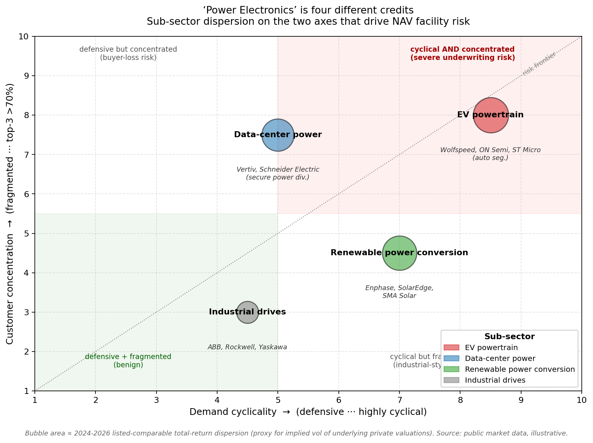
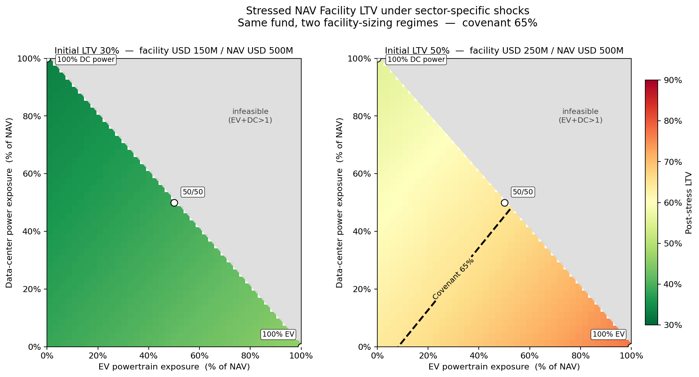

# A Power-Electronics Risk Lens on NAV Facilities

### *A first look from a Polimi EE student exploring fund finance*

---

> **TL;DR** — 2026 NAV/hybrid facilities are growing into mainstream
> private-markets liquidity tooling, and the next underwriting
> bottleneck is **sector-specific risk modelling** for concentrated
> portfolios. "Power electronics" is one of those concentrated
> portfolios — and it is internally heterogeneous in a way that
> single-sector haircuts miss. This page shows the gap, then a small
> Python model that quantifies it.

---

## 1. The 2026 Setup

NAV financing has moved from a niche product into what the 15th Fund
Finance Association Global Symposium described as a **"core liquidity
solution across private markets"**, driven by extended exit timelines
and evolving LP expectations
([Macfarlanes, 2026](https://www.macfarlanes.com/insights/102miui/nav-igating-the-future-trends-from-the-15th-ffa-global-symposium/)).
Hybrid facilities — combining subscription and NAV pledges — are
gaining traction *specifically* because they handle **concentrated
portfolios** better than single-collateral structures
([Norton Rose Fulbright](https://www.nortonrosefulbright.com/en/knowledge/publications/4ea5bea9/navigating-the-growth-of-nav-and-hybrid-facilities-in-funds-finance)).
The Ropes & Gray 2026 outlook is explicit: the growth area will be
*"greater sector specialisation and broader adoption across
geographies and asset classes"*
([Ropes & Gray, 2026](https://www.ropesgray.com/en/insights/alerts/2026/02/global-fund-finance-symposium-2026-evolving-market-trends)).

> **The implication** I keep returning to as an outsider:
> lenders increasingly need underwriting capability that can *read
> the underlying technology cycle* — not just pull a sector haircut
> from a table. Below is a small example of why that matters in one
> sector I happen to know.

---

## 2. Why Power Electronics Is the Hardest Sector to Underwrite Right Now

"Power electronics" looks like one sector on a fund's investment-policy
slide. From a technology and end-market perspective, it is **four very
different credits** stitched together — each with its own demand
driver, cyclicality, and customer concentration:

| Sub-sector                  | Demand driver               | Cyclicality           | Customer concentration |
|-----------------------------|-----------------------------|-----------------------|------------------------|
| **EV powertrain** (inverters, OBC, DC-DC) | Consumer auto cycle        | High, consumer-led    | 5–10 OEM buyers        |
| **Data-center power** (PSU, UPS, AI rack power) | Hyperscaler AI capex       | Lumpy super-cycle     | 3–5 hyperscalers       |
| **Renewable power conversion** (solar, wind inverters) | Subsidy + tariff regime    | Policy-driven         | Utilities + EPCs       |
| **Industrial drives**       | Industrial CapEx / IIoT      | Mid-cycle, defensive  | Fragmented             |

### The empirical reality check (2024 – 2026)

| Listed comparable     | Sub-sector            | 2024–2026 total return |
|-----------------------|-----------------------|------------------------|
| **Wolfspeed**         | EV powertrain (SiC)   | **≈ −70%**             |
| **ON Semiconductor**  | EV powertrain         | ≈ −40%                 |
| **Vertiv Holdings**   | Data-center power     | **≈ +280%**            |
| **Schneider Electric** (secure-power div.) | Data-center power | ≈ +60% |
| **Enphase Energy**    | Renewable power conv. | ≈ −75%                 |
| **ABB**               | Industrial drives     | ≈ +25%                 |

> The dispersion is the point. **A NAV facility extended against a
> fund 60% concentrated in EV powertrain is a fundamentally different
> credit than one 60% concentrated in data-center power — even though
> both fall under "power electronics".**
>
> A single-sector haircut applied to both materially under- or
> over-prices the risk depending on the tilt.

---

## 3. A Small Sensitivity Experiment

I built a deliberately small Python model
([`code/nav_stress_model.py`](../code/nav_stress_model.py)) to make
the dispersion visible numerically.

**Setup**
* Hypothetical PE fund, $500M NAV, concentrated in power electronics.
* Two facility-sizing regimes compared head-to-head:
  - **Benign**: $150M facility (initial LTV 30%)
  - **Aggressive**: $250M facility (initial LTV 50%)
* Covenant LTV 65% (default trigger) in both cases.
* Each sub-sector takes a stress drawdown calibrated to its 2024–2026
  listed-comparable move, dampened ~30% to reflect that private NAV
  marks lag (assumption parameters — and their defence — are in
  [`code/pseudocode.md §3.2`](../code/pseudocode.md#32-why-those-specific-stress-numbers)).

**Output** — stressed LTV as you sweep EV vs data-center exposure
(remaining mix is renewable + industrial in a 60/40 residual split):

> **Read the dashed line.** On the left panel the post-stress LTV
> never reaches the 65% covenant — facility size is too conservative
> for any tilt to matter. On the right panel the dashed contour cuts
> the feasible region in half: every portfolio to the **lower-right
> of that line is in covenant breach**. The breach region is almost
> entirely an EV-tilt region. **Same fund, same shock assumptions —
> only the facility sizing changed, and a single-bucket "power
> electronics" haircut would be blind to which side of the line you
> sit on.**

### Reference portfolios (text-form sanity check)

| Portfolio                          | Drawdown | Stressed NAV | LTV @ 30% initial | LTV @ 50% initial |
|------------------------------------|----------|--------------|-------------------|-------------------|
| **100% EV powertrain**             | −35.0%   | $325M        | 46.2%             | **76.9% — BREACH** |
| **100% data-center power**         | −10.0%   | $450M        | 33.3%             | 55.6%             |
| **Diversified (25 each)**          | −21.25%  | $393.75M     | 38.1%             | 63.5%             |

### What the model is **not** trying to do

* It is not a production NAV pricing model. Real advance rates,
  recoveries, and inter-period redetermination are absent.
* The stress numbers are illustrative anchors, not consensus haircuts.
* Cross-sub-sector correlation is implicitly zero; in practice EV and
  data-center are both rate-sensitive and would co-move partially.

### What it **is** trying to make obvious

* Even at a benign initial 30% LTV, tilting fully into EV powertrain
  pushes stressed LTV ~50% higher than tilting fully into data-center
  power. **At an aggressive 50% initial LTV, the same tilt would breach
  the 65% covenant** — and a model that treats "power electronics"
  as one bucket simply cannot see this.
* The fix is not more complex math. It is **someone on the desk
  capable of decomposing the portfolio into sub-sectors and assigning
  defensible drawdown views** — which is a skill that benefits from
  technical familiarity with the underlying engineering.

---

## 4. Where I Sit, Honestly

I am an EE Master's student at **Politecnico di Milano**. My
hands-on background is in power-electronics design — most recently an
EMI-filter design project for a switched-mode converter — which is
why I picked that sector as the worked example above rather than
something I would have had to fake.

* What I **don't yet know**: real advance-rate conventions, the
  workout mechanics of NAV facility breaches, how UniCredit's desk
  prices hybrid structures, the legal/credit-doc grammar.
* What I **think I can offer**: an engineer's reflex for decomposing
  heterogeneous portfolios into the actual risk drivers, and the
  technical literacy to do that decomposition fast in sectors where
  the underlying technology cycle is the credit story.

### If I had 30 minutes with the desk

1. Validate or destroy the sub-sector stress assumptions against
   actual realised PE marks.
2. Add a correlation block — at minimum a 2-factor model (rate
   sensitivity, AI-capex sensitivity).
3. Extend to hybrid-facility logic: subscription line as the
   "fallback rail" when NAV LTV drifts toward covenant.

If any of this is useful, the source for the model and figures lives
in [`code/`](../code/) — happy to walk through it.

---

### Sources

1. *NAV-igating the future: Trends from the 15th FFA Global
   Symposium* — Macfarlanes, 2026.
2. *Global Fund Finance Symposium 2026: Evolving Market Trends* —
   Ropes & Gray, 2026.
3. *Navigating the growth of NAV and hybrid facilities in Funds
   Finance* — Norton Rose Fulbright.
4. *NAV financing moves mainstream, Fund Finance Securitisation Forum
   panel explores* — Funds Europe.
5. Public-market data: Wolfspeed, Vertiv, Schneider Electric, Enphase,
   ON Semiconductor, ABB total returns 2024-2026.

---

*This page was put together as a first-look deliverable. It is not a
client document, an investment recommendation, or an authoritative
view on any UniCredit product. All figures are illustrative.*
